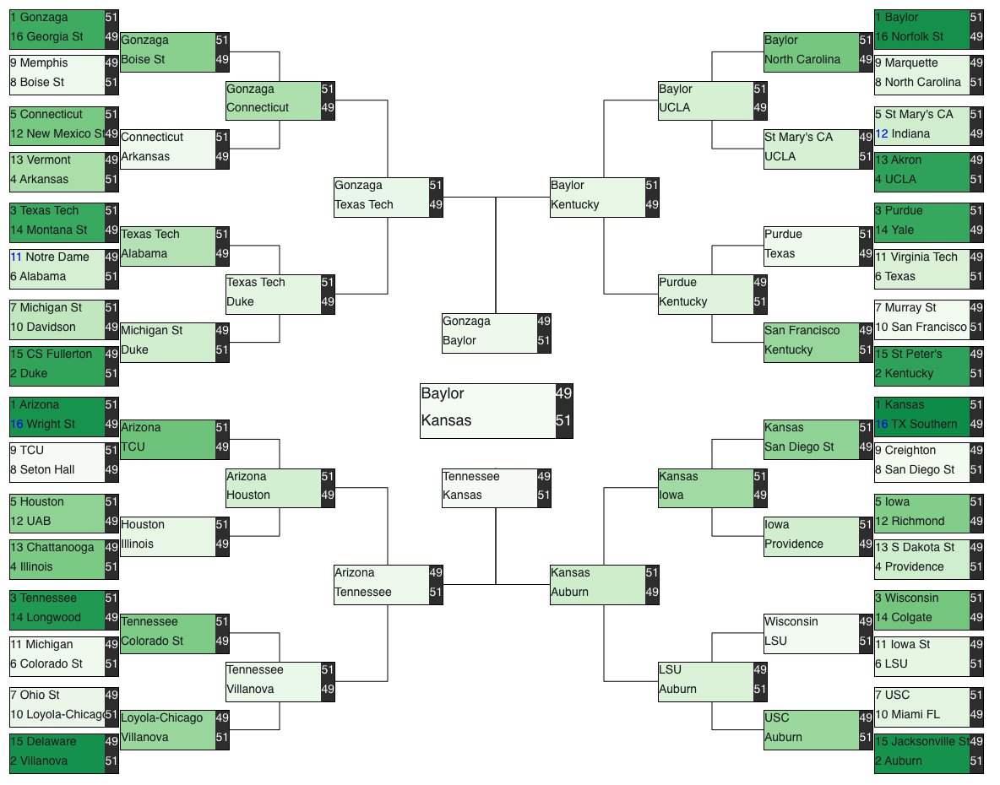

# March_Madness
My predictions for the 2021 and 2022 March Madness Tournament

## 2021 Results

In 2021, I leveraged the kaggle input data and combined with kenpom data. I then applied a Gradient Boosting Classifier and predicted the results.

My resulting bracket was pretty decent. It had an overall log loss 0.66587 of which put me at #503 (out of 707) on the Kaggle March Madness prediction leaderboard.

## 2022 Steps

(1) Used input data from Kaggle competition and created a feature set

(2) Combined Kaggle feature set with scraped Kenpom Data

(3) Trained a Gradient Boosting Algorithm on past tournament results

(4) Used trained model to predict the win probability of each potential game in the 2021 tournament

(5) Plotted results in bracket

## 2022 Predictions

visualization source: https://observablehq.com/@sdpetrides/visualize-your-kaggle-brackets-for-march-madness
