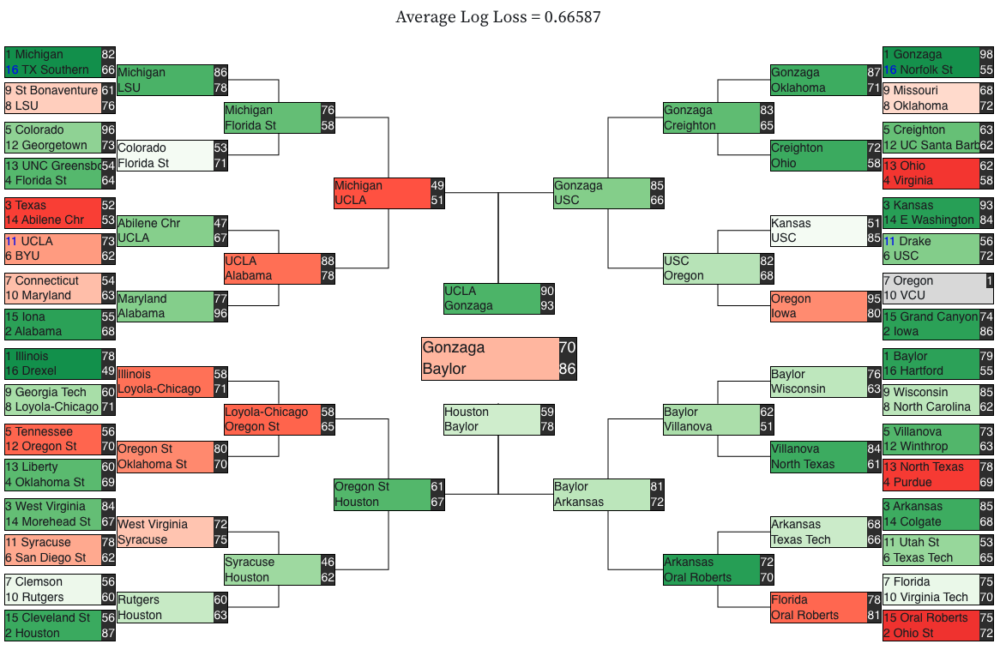
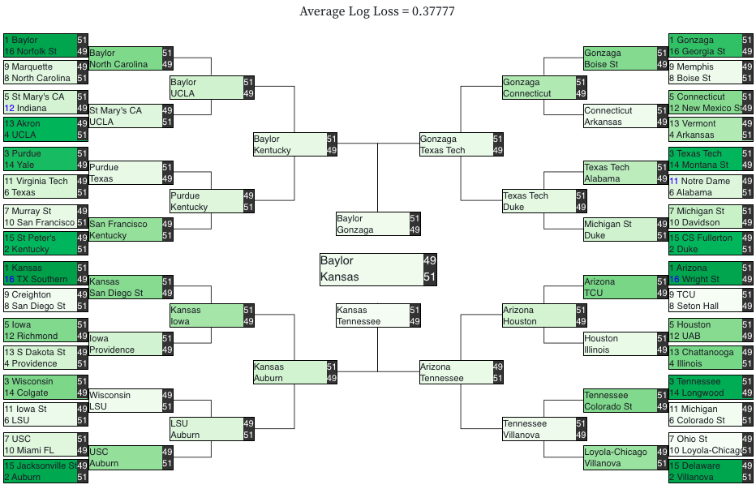

# March_Madness
My predictions for the 2021, 2022, and 2023 March Madness Tournament

## 2021 Results

In 2021, I leveraged the kaggle input data and combined with kenpom data. I then applied a Gradient Boosting Classifier and predicted the results.

My resulting bracket was pretty decent. It had an overall log loss 0.66587 of which put me at #503 (out of 707) on the Kaggle March Madness prediction leaderboard.

## 2022 Results

In 2022, I followed a similar method however this time I applied a Gradient Boosting Classifier. My bracket ended up predicting the champion (Kansas) and my braket ended up #143 (out of 930 teams) and a log loss of 0.61624. This was quite a big improvement over previous years, however I think most of this gain is due to predicting the correct champion.

## 2023 Predictions

Now, we are gonna predict the results for each game in the 2023 tourament and print the results (hopefully improving on the past two years)

### Changes From Previous Years

(1) I used only data from years 2011 and later for this model. I have a suspicion that the years prior add little additional value given how much college basketball has evolved due to transfer/recruiting changes

(2) Fixed Kenmpom Data Leakage. Prior Kenpom data was biased because it took into account tournament results. I used archived pages to get the Kenpom rankings pior to the tournament starting in each year.

(3) Using a LGBMClassifer instead of GBM and Extra Trees Classifiers in previous years. The LazyClassifier model ranked this classifier as having the best predictive capabilities.

(4) Printed the braket using a different module. The submission file is different this year so I had to find an uglier solution.

### Steps

(1) Import Train & Test Sets and combine with Kenpom data

(2) Prepare sets for model training

(3) Use Lazy Predict to test multiple model types

(4) Apply a LGBMClassifier to predict the win probility of each potential game

(5) Analyze Results

### pdf of bracket: https://github.com/mdenko/March_Madness/blob/main/march_madness_2023/outputs/2023_predictions.pdf

<embed src="[march_madness_2023/outputs/2023_predictions.pdf](https://github.com/mdenko/March_Madness/blob/main/march_madness_2023/outputs/2023_predictions.pdf)" type="application/pdf">

<object data="https://github.com/mdenko/March_Madness/blob/main/march_madness_2023/outputs/2023_predictions.pdf" type="application/pdf" width="100%"> 
</object>

